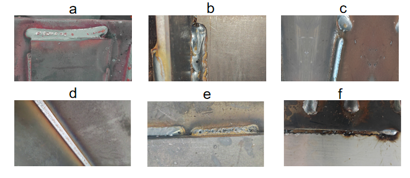
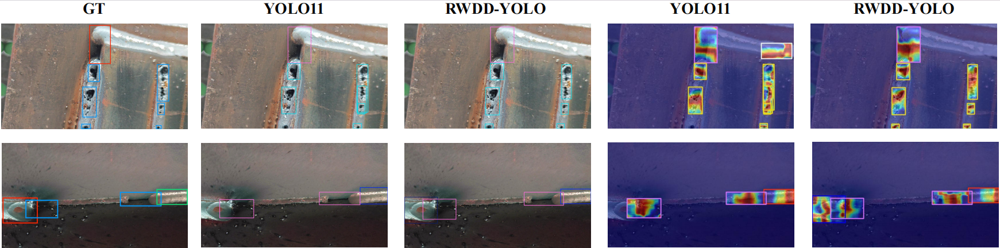
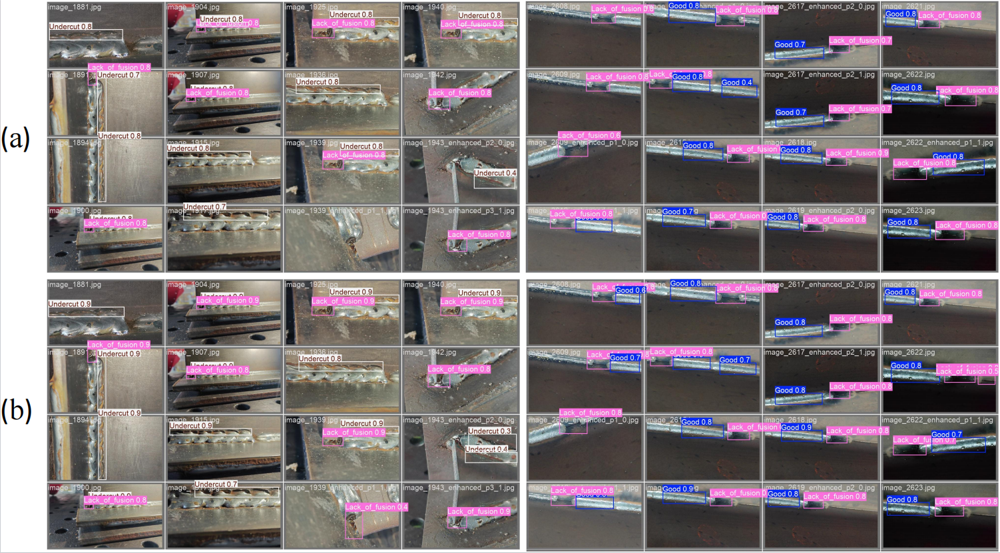

# Multi-Kernel Perception-Enhanced Feature Learning for Industrial Weld Defect Detection

  
  
  
  

## Table of Contents

- [Introduction](#introduction)
- [Key Challenges in Industrial Measurement](#key-challenges-in-industrial-measurement)
-[Proposed Methodology: YOLO-DMSE](#proposed-methodology-yolo-dmse)
-[WD-DEFT Benchmark](#wd-deft-benchmark)
- [Experimental Results](#experimental-results)
-[Dataset Access Notification](#dataset-access-notification)
- [Citation](#citation)
- [License](#license)

---

## Introduction

Automated weld defect detection is crucial for ensuring product quality and structural reliability in modern manufacturing. However, applying generic object detectors to authentic industrial scenarios is frequently impeded by severe background interference and extreme defect scale variations. 

To bridge the domain gap between laboratory research and real-world factory deployment, we propose **YOLO-DMSE**, a high-precision, real-time detector engineered for complex industrial environments. Furthermore, we introduce the **WD-DEFT (Weld Defect)** dataset, a comprehensive benchmark acquired directly from authentic industrial manufacturing lines with high ecological validity.

This repository contains the official implementation of our proposed method and instructions for accessing the WD-DEFT dataset.

---

## Key Challenges in Industrial Measurement

Deploying visual inspection systems in authentic welding scenarios presents distinct technical bottlenecks:

- **Severe Background Interference (Low SNR):** Industrial imaging is plagued by complex optical interference, such as arc glare, metal spatter, and surface reflections. Critical micro-defects are frequently submerged in high-frequency background textures, resulting in a critically low Signal-to-Noise Ratio (SNR).
- **Extreme Morphological Heterogeneity:** Welding defects exhibit drastic variations in scale and shape—ranging from highly anisotropic linear faults (e.g., lack of fusion, undercut) to isotropic minute features (e.g., porosity). 
- **The Accuracy-Efficiency Paradox:** Industrial online monitoring imposes stringent real-time constraints. Existing large-scale models fail to meet real-time inference requirements on resource-limited edge devices, while lightweight models often lack the representation capacity for complex defect morphologies.

---

## Proposed Methodology: YOLO-MKPE

To break the inherent trade-off between detection accuracy and inference speed, YOLO-DMSE integrates three physics-aware architectural innovations:

1. **Dynamic Multi-kernel Perception Unit (DMPU):** Employs an Adaptive Kernel-Mixture (AKM) mechanism with parallel branches of varying kernel shapes (e.g., strip and square kernels). This design robustly captures multi-scale, orientation-aware features for both compact isotropic patterns and elongated directional faults.
2. **C2PSA with Dynamic Tanh (C2PSA-DYT):** Functions as a content-aware signal calibrator. By incorporating a learnable non-linear Dynamic Tanh layer, it acts as a soft-thresholding filter that amplifies weak defect signals while effectively suppressing high-intensity impulsive noise (e.g., spatter) prior to feature aggregation.
3. **Lightweight Shared Convolutional Detection Head (LSCD):** Utilizes a "Divide-Unify-Decouple" deep parameter sharing paradigm. It significantly enhances cross-scale feature generalization while minimizing model complexity, ensuring optimal deployment on resource-constrained devices.

---

## WD-DEFT Benchmark

To address the absence of a unified public benchmark with high ecological validity, we constructed the WD-DEFT dataset.

<i>Representative samples from the WD-DEFT dataset illustrating the 6 specific classes.</i>

- **Data Acquisition:** Acquired from authentic industrial sites using a Hikrobot MV-CU050-90GC industrial camera.
- **Scale:** Comprises **6,071** high-resolution images encompassing **13,583** independently annotated instances.
- **Categories:**  Covers 6 specific classes, including 5 critical weld defects and a control group of defect-free samples to mitigate false positive rates in practical production. As illustrated in the figure above, the classes are categorized as follows:

a: Misalignment
b: Undercut
c: Lack of fusion
d: Good
e: Porosity
f: Burn-through

## Experimental Results

Extensive evaluations on the WD-DEFT benchmark demonstrate that YOLO-DMSE achieves a superior Pareto frontier for industrial defect inspection:

- **Detection Precision:** YOLO-DMSE-N achieves an **mAP50 of 90.1%** and **mAP50-95 of 49.5%**, outperforming the YOLO11-N baseline by 1.6% and 0.9%, respectively.
- **Computational Efficiency:** Attains a **12% reduction in parameters** (down to 2.2M) and a **19% reduction in FLOPs** (5.1G) compared to the baseline.
- **Real-Time Capability:** Maintains an ultra-fast inference speed of **201 FPS**, fully satisfying the stringent requirements of high-speed manufacturing lines.

**(a) Grad-CAM Heatmap Visualization**  
*Illustrates the model's attention. The highlighted areas show that YOLO-DMSE focuses precisely on actual defect regions, effectively minimizing background interference.*

**(b) Prediction Results**  
*Shows the final detection outputs. It demonstrates the model's high precision in localizing bounding boxes and classifying industrial defects with high confidence.*

## Dataset Access Notification

**⚠️ The raw image data within the WD-DEFT dataset is subject to strict access restrictions.**

Since the WD-DEFT dataset is acquired from authentic and active industrial production lines, it contains sensitive proprietary manufacturing characteristics. Therefore:
1. **Academic Use Only:** This dataset is strictly restricted to academic and non-profit research purposes.
2. **Commercial Prohibition:** Any form of commercial usage, redistribution, or application in commercial product training is strictly prohibited.

**How to Request Access:**
If you wish to utilize this dataset for your research, please contact the corresponding authors via email with your institutional affiliation and a brief description of your research plan. Access will be granted upon successful review and approval.
The WD-DEFT dataset can be accessed from 
https://drive.google.com/drive/folders/1qYzLOM4aRmVsyQwWzmM_e74D2xHAHkNd?usp=sharing

If you have any questions, ideas, or collaboration proposals, please feel free to open an issue or reach out directly!

---

## Citation

